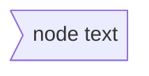

# mermaid

[rich-iannone.github.io/DiagrammeR/mermaid](https://rich-iannone.github.io/DiagrammeR/mermaid.html)

## graph
- `LR` left to right
- `RL` right to left
- `TB` top to bottom
- `BT` bottom to top
- `TD` top down (same as `TB`)

- `-->` arrow connection
- `---` line connection
- `==>` `==` thick line

## Flowchart

## Sequence diagram

## git graph

## see also

- [[markdown]]

