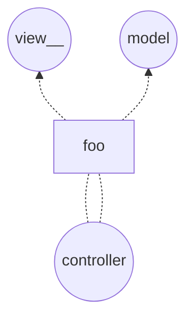

# pattern model view controller

from stackskills byte sihe chungs: java mvc

`architectural pattern` for user-interfaces

`Model`: stores data underlying the user interface
`View`: visual representation
`controller`: interacts with user and modifies the model and the view

@startuml
:User: as user
(view)<--(user):sees\nthe
(controller)<--(user):interacts\nwith
(view)<..(controller):updates
(model)<..(controller):updates
(view)<..(model):updates
@enduml

```mermaid 
graph BT
  c((controller)) -- foo --> ((vview__))
  c((controller)) -- foo --> ((mmodel))
``` 




What is the basic point of th e mvc-pattern ?
* seperation of data from its visual representation
* seperation of data from its manipulation
* allowing different simultanesous represenations of the same data


[Use case Diagram syntax and features](http://plantuml.com/use-case-diagram)
